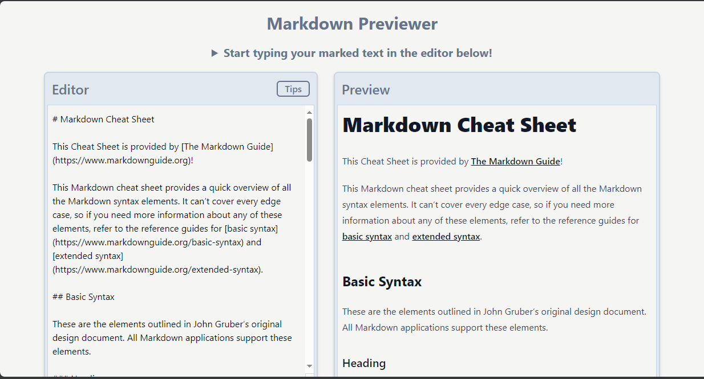

# Markdown Previewer Documentation



## Overview

Welcome to my Markdown Previewer! This React-based web application allows users to input Markdown text in an editor and instantly see the live preview of the formatted content. Tailwind CSS is used for styling, and Zustand is employed for state management. The project consists of two components, Editor and Preview, and incorporates React Helmet for SEO optimization. The site is designed as a Single Page Application (SPA) using React Router.

## Project Structure

- **React Components**: The project is divided into two main components - Editor and Preview - each responsible for handling specific aspects of the application.
  
- **Tailwind CSS**: Styling is implemented using Tailwind CSS, providing a sleek and responsive user interface.

- **Zustand for State Management**: Zustand is used to manage the state of the application, ensuring efficient and predictable state updates across components.

- **React Helmet for SEO**: React Helmet is employed to enhance the SEO aspects of the application, optimizing it for search engine visibility.

## Features

- **Live Markdown Preview**: Instantly see the formatted preview of the Markdown text as you type in the editor.

- **Sample Markdown Text**: The application loads with sample Markdown text, providing users with a quick start and showcasing the rendering capabilities.

- **Markdown Tips Button**: Users can access helpful Markdown tips by clicking a dedicated button within the application.

## Concepts Demonstrated

1. **React**: The project is built using React, demonstrating the use of components, state, and lifecycle methods.

2. **Tailwind CSS**: Tailwind is leveraged for efficient and responsive styling, creating a visually appealing user interface.

3. **Zustand for State Management**: Zustand is used to manage the state of the application, ensuring a single source of truth and facilitating state updates across components.

## How to Use

### Get a local version

1. Clone the repository to your local machine.
   ```bash
   git clone https://github.com/theAvocadoCoder/markdown-previewer.git
   ```

2. Navigate to the project directory and install dependencies.
   ```bash
   cd markdown-previewer
   npm install
   ```

3. Start the development server.
   ```bash
   npm start
   ```

4. Open your web browser and visit `http://localhost:3000`.

5. Enjoy the live Markdown preview, experiment with your own Markdown text, and check out the Markdown tips.

### View the live site

Alternatively, you can view the live site [here](https://theavocadocoder.github.io/markdown-previewer/).

## About Me

I am a junior developer passionate about creating interactive and engaging web applications. This project reflects my ongoing learning journey and commitment to mastering essential programming concepts.

Feel free to reach out if you have any questions or suggestions for improvement!

Happy Markdown previewing! 🚀
